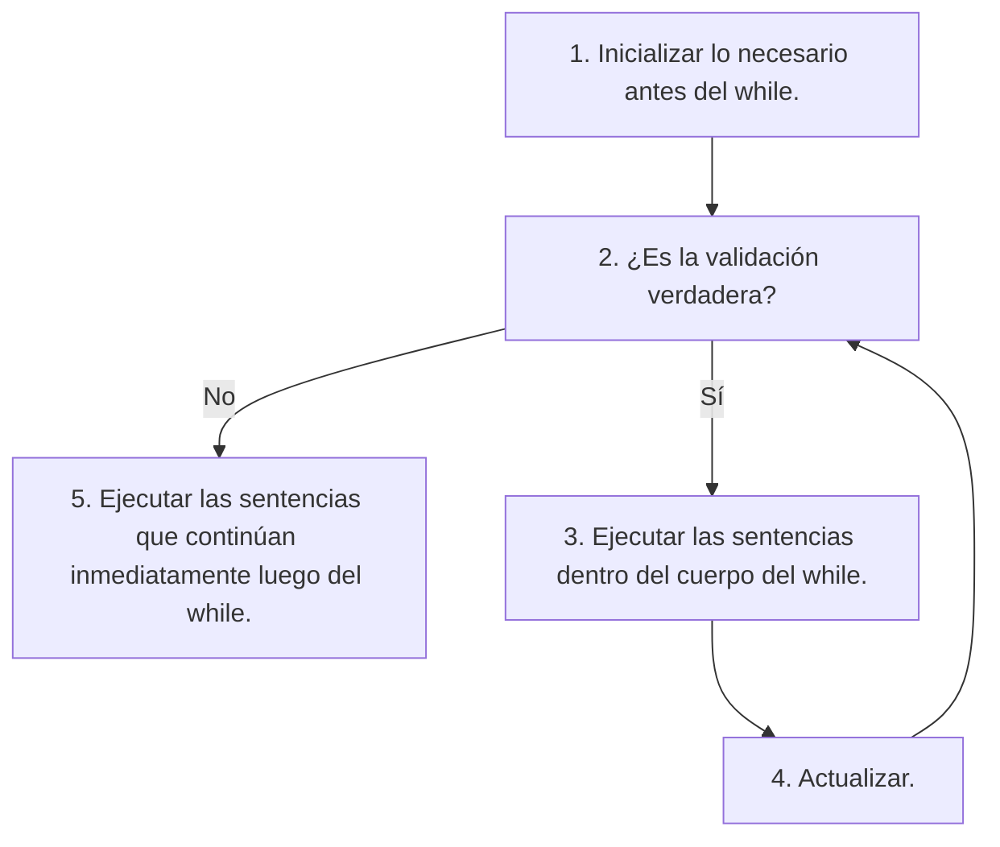
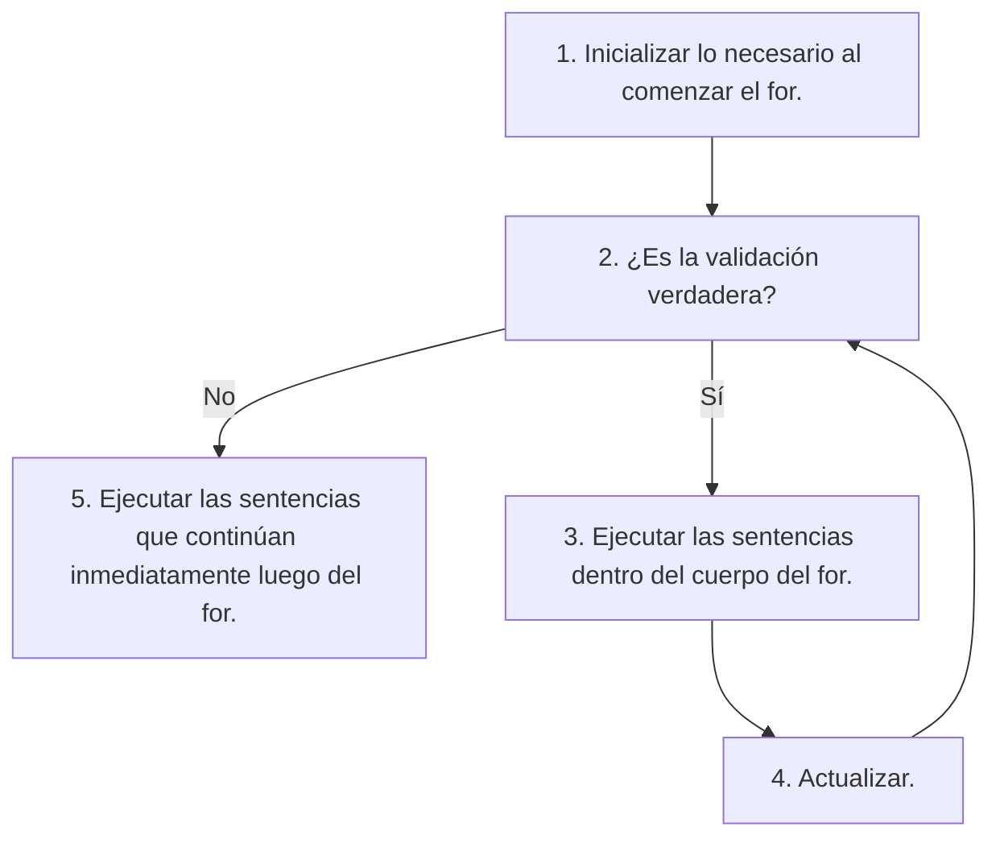

# Sentencias iterativas

Las estructuras sintácticas que controlan la ejecución de otras sentencias
son conocidas como sentencias iterativas.

De acuerdo a la documentación,
las siguientes sentencias son utilizadas para este propósito::
- `while`
- `do-while`
- `for`

En este caso,
solo nos enfocaremos en `while` y `for`.
Personalmente,
nunca he tenido la necesidad de utilizar `do-while`,
ya que siempre he podido convertir su funcionalidad a un `while`.

Bjarne Stroustrup, el creador de C++,
menciona una experiencia similar en la cuarta edición de su libro
*The C++ Programming Language*, en la página 236:

> In my experience,
> the do-statement is a source of errors and confusion.
> The reason is that its body is always executed once before
> the condition is evaluated.
> However, for the body to work correctly,
> something very much like the condition must hold even the first time through.
> More often than I would have guessed,
> I have found that condition not to hold as expected either
> when the program was first written and tested or
> later after the code preceding it has been modified.
> I also prefer the condition up front where I can see it.
> Consequently, I recommend avoiding do-statements.

## La sentencia `while`

Ejecuta repetitivamente el cuerpo
mientras que el resultado de la validación
sea verdadero.

```
inicialización
while (validación) {
    cuerpo (sentencias que se repetirán)
    actualización
}
```



### ¿Qué almacena la variable `x`?

```cpp
// Asume que suerte está definida
// como un entero en [1, 6].

int lanzamiento = -1;
int x = -1;
while (lanzamiento != suerte) {
    lanzamiento = 1 + rand() % 6;
    if (x < lanzamiento) {
        x = lanzamiento;
    }
}
cout << "Numero de la suerte: " << lanzamiento << endl;

/*
 * A. El último valor obtenido.
 * B. El primer valor obtenido.
 * C. El mayor valor obtenido.
 * D. El menor valor obtenido.
 * E. -1.
 * F. El programa no compila.
 */
```

## La sentencia `for`

```
for (inicialización, validación, actualización) {
    cuerpo (sentencias que se repetirán)
}
```



### ¿Qué salida produce el siguiente código?

```cpp
for (int i = 1; i <= 6; i++) {
    cout << i << " al cuadrado es " << i * i << endl;
}
```

```
Salida A:
i al cuadrado es i * i
i al cuadrado es i * i
i al cuadrado es i * i
i al cuadrado es i * i
i al cuadrado es i * i
i al cuadrado es i * i

Salida B:
i al cuadrado es i * i
i al cuadrado es i * i
i al cuadrado es i * i
i al cuadrado es i * i
i al cuadrado es i * i
i al cuadrado es i * i
i al cuadrado es i * i

Salida C:
1 al cuadrado es 1
2 al cuadrado es 4
3 al cuadrado es 9
4 al cuadrado es 16
5 al cuadrado es 25
6 al cuadrado es 36

Salida D:
1 al cuadrado es 1
2 al cuadrado es 4
3 al cuadrado es 9
4 al cuadrado es 16
5 al cuadrado es 25
6 al cuadrado es 36
7 al cuadrado es 49
```

### ¿Qué salida produce el siguiente código?

```cpp
for (int i = 1; i <= 5; i++) {
    for (int j = 1; j <= i; j++) {
        cout << i;
    }
    cout << endl;
}
```

```
Salida A:
1
12
123
1234
12345

Salida B:
i
ii
iii
iiii
iiiii

Salida C:
1
22
333
4444
55555
```

### ¿Qué código produce la siguiente salida?

```
1
12
123
1234
12345
```

```cpp
// Código A:
for (int i = 1; i <= 5; i++) {
    for (int j = 1; j <= i; j++) {
        cout << i;
    }
    cout << endl;
}

// Código B:
for (int i = 1; i <= 5; i++) {
    for (int j = 1; j <= i; j++) {
        cout << j;
    }
    cout << endl;
}

// Código C:
for (int i = 1; i <= 5; i++) {
    for (int j = 1; i <= j; j++) {
        cout << j;
    }
    cout << endl;
}

// Código D:
for (int i = 1; i <= 5; i++) {
    for (int j = 1; j <= i; i++) {
        cout << j;
    }
    cout << endl;
}
```

## `for` versus `while`

¡Los bucles `for` y `while` son casi lo mismo!

```cpp
for (int i = 0; i < n; i++) {
    // ...
}
```

La minuciosa diferencia técnica yace en el alcance de la variable `i`.

```cpp
int i = 0;
while (i < n) {
    // ...
    i++;
}
```